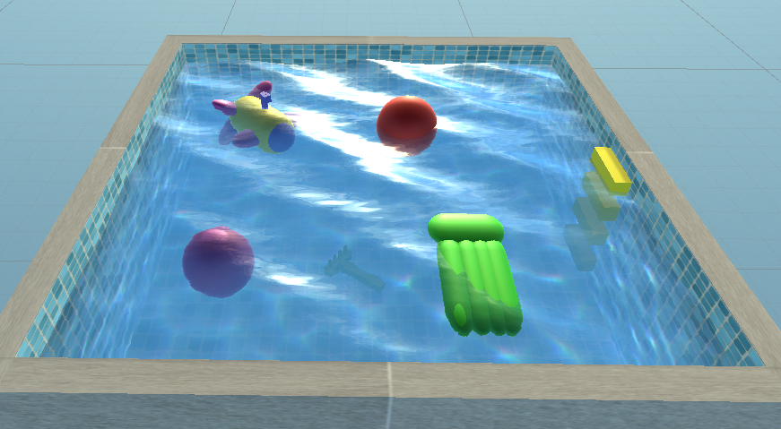
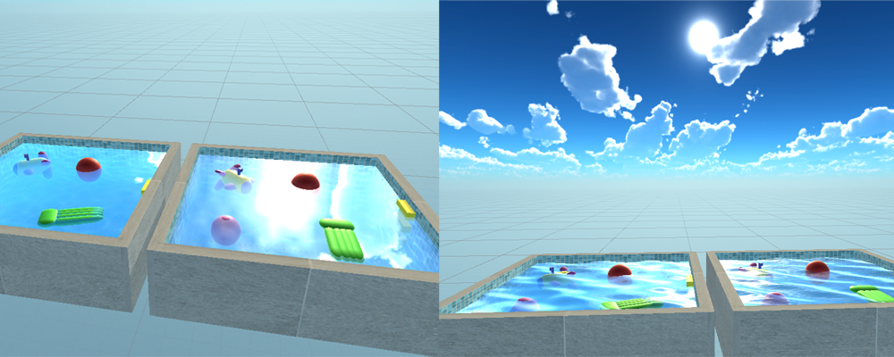
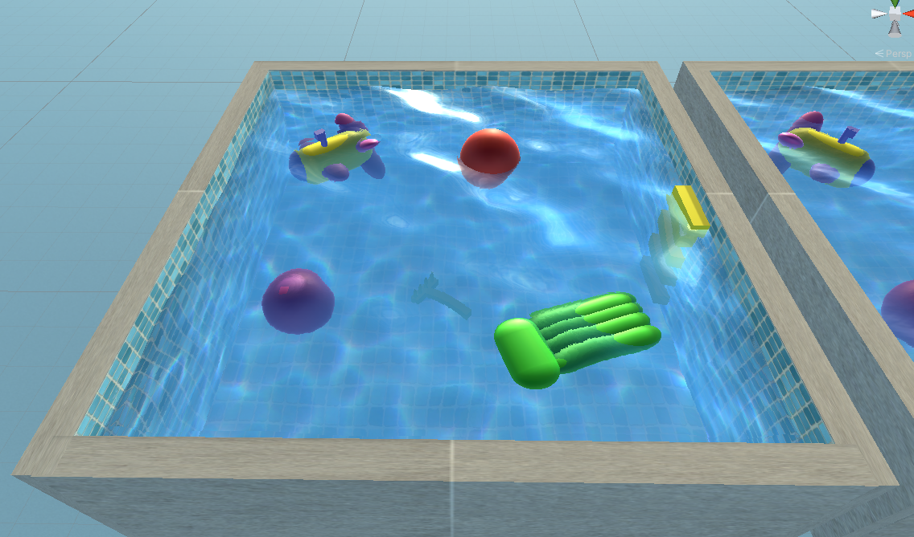
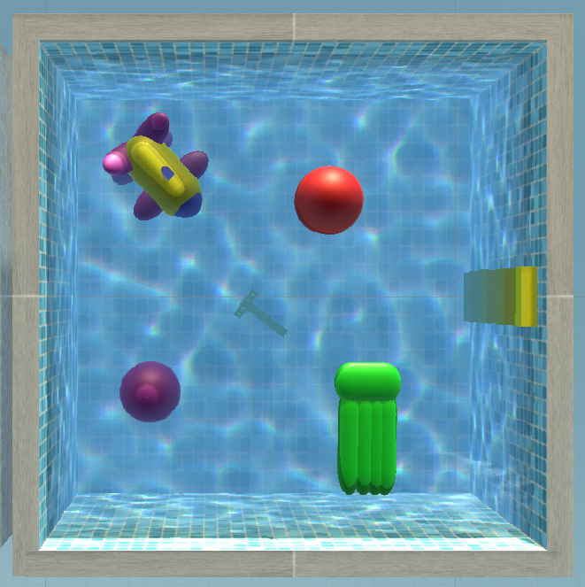
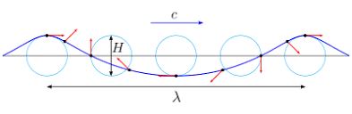
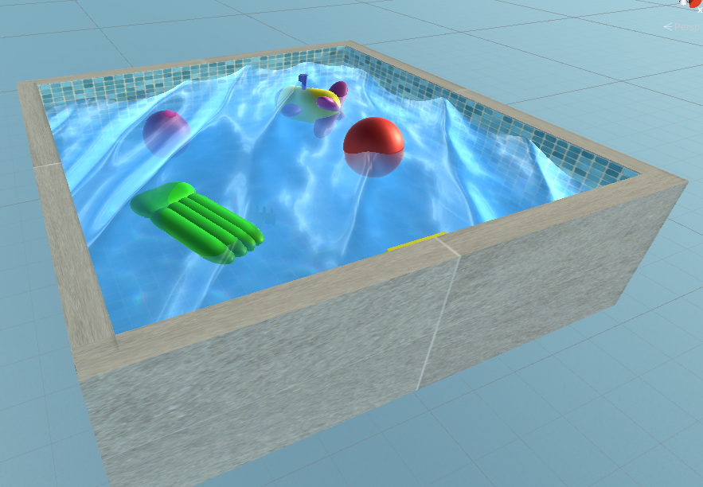
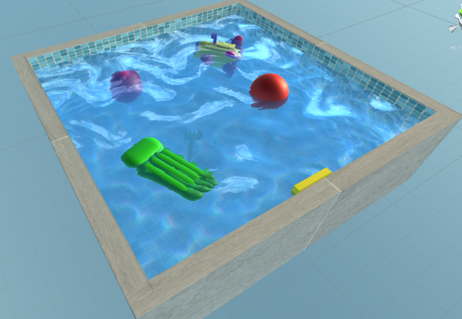
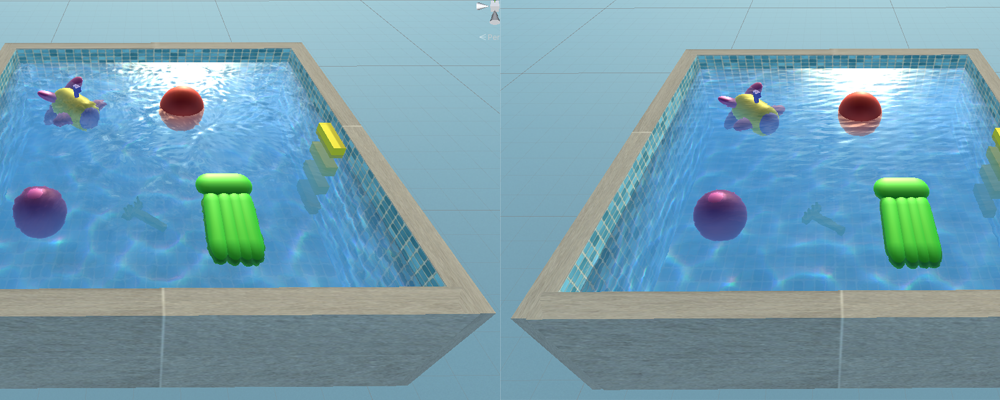
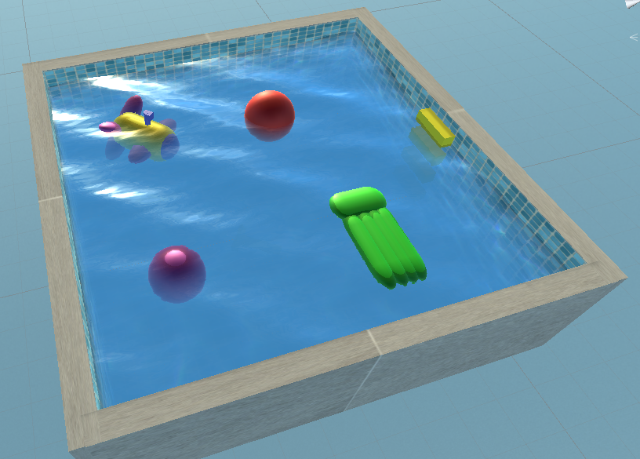
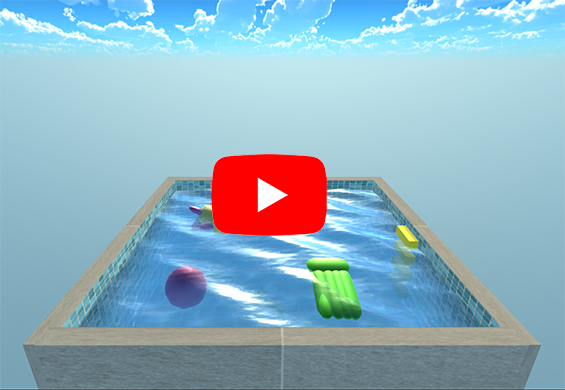

# Water shader in Unity 3D

## Summary
&nbsp;&nbsp;&nbsp;&nbsp;The goal of this project is to create as realistic water as possible using Shaders in Unity3D. Realistic water was achieved by implementing selected water effects:
* [Reflection](https://github.com/leonjovanovic/unity-water-shader/blob/main/README.md#reflection)
* [Refraction](https://github.com/leonjovanovic/unity-water-shader/blob/main/README.md#refraction)
* [Caustics](https://github.com/leonjovanovic/unity-water-shader/blob/main/README.md#caustics)
* [Waves](https://github.com/leonjovanovic/unity-water-shader/blob/main/README.md#waves)
* [Flow](https://github.com/leonjovanovic/unity-water-shader/blob/main/README.md#flow)
* [Underwater fog](https://github.com/leonjovanovic/unity-water-shader/blob/main/README.md#underwater-fog)

[Video](https://github.com/leonjovanovic/unity-water-shader/blob/main/README.md#video)

*Directional water*

## Reflection
&nbsp;&nbsp;&nbsp;&nbsp;The reflection implemented in this paper is a simplified Fresnel's reflection. The reflection will only be applied to the distant environment (skybox), which will be mapped to the surface of the water. It is necessary to calculate the reflected vector in relation to the surface of the water. The reflected vector will be used to sample the skybox. The output color of the observed fragment will be sampled part from skybox.

&nbsp;&nbsp;&nbsp;&nbsp;The water view angle was also taken into account, so that the output color was multiplied by 1 - the angle between the water normal and the vector from the camera to the fragment on the water. This leads to the desired result where if the angle is 0 (the camera is located parallel to the water), the reflection will be 0 and vice versa.

*Reflection on calm and turbulent water*

## Refraction

&nbsp;&nbsp;&nbsp;&nbsp;Effect of refraction was achieved with the use of the so-called DuDv maps (false refraction). It is a texture that contains already calculated derivatives of the water normals. In order to simulate the false refraction, it is necessary to move the initial UV (texture) coordinates so that when we sample the objects using slightly shifted UV coordinates, the objects themselves look shifted.

&nbsp;&nbsp;&nbsp;&nbsp;Refraction also depends on the water turbulence. If the water is calm, the refraction results in a slightly shifted underwater image, but if the water has waves and a surface flow, the refraction is much stronger.

&nbsp;&nbsp;&nbsp;&nbsp;The simplicity of this solution is reflected in the fact that we can use the XY component of the water normals for the displacement that will be added to the original UV coordinates. Such solution gives us efficiency due to fast calculation of normals (via sampled derivatives) and accuracy, because if the water is turbulent, the water normals will also change and thus the refraction. 

*Water refraction*

## Caustics

&nbsp;&nbsp;&nbsp;&nbsp;The algorithm consists of sampling the caustics texture twice with UV coordinates that have different displacements. The RGB components from the two samples needs to be separated to create an effect where different wavelengths of light are refracted differently when passing through water. Finally, it is necessary to mix the two obtained textures.

&nbsp;&nbsp;&nbsp;&nbsp;The UV shift must be different for the two samples to achieve distortion effect. Also the shift in both cases must be a function of time in order to move constantly. An additional parameter s is introduced, which will specify an additional shift to separate the colors. The separation of the RBG component is calculated by moving the UV coordinate by (s, s), (s, -s), (-s, -s) in the case of the R, G, B components, respectively. After that we have the final UV coordinates that we need to sample from the caustic texture. We sample three times for each component and take the R component from the first, G from the second, and B from the third color. Combine all three components into one color and repeat the whole separation process for the UV coordinates of the second sample.

&nbsp;&nbsp;&nbsp;&nbsp;In the end, we combine the two colors and get the final color of the caustic, which we add to the color of the object and get the final color of the object. 

*Water caustics*

## Waves

&nbsp;&nbsp;&nbsp;&nbsp;In the implementation of Gerstner waves, each vertex in the water mesh rotates within its circle depending on location of the previous and the next wave. Therefore, when the wave comes, the point will move backwards and upwards clockwise until it reaches the top when it begins to move forward and down.
 

*Motion of vetices in a Gerstner wave*

&nbsp;&nbsp;&nbsp;&nbsp;With the Gerstner wave, a new parameter is introduced - the slope. Amplitude is calculated from the slope and wavelength, while speed is calculated from gravity and wavelength. We need to calculate the position of the vertex based on the wave formula. After calculating the formula for each component of a vertex, it is necessary to calculate the tangent and binormal in order to obtain the vertex normals. The tangent and binormal are calculated as the partial derivative P'(x, y, z) along the x and z axis. Normal is calculated as vector product of tangent and binormal. Although by applying the Gerstner wave we get a much more realistic wave, we still need to generate more than one wave. 

*Gerstner waves*

## Flow

&nbsp;&nbsp;&nbsp;&nbsp;Unlike waves where we changed the position of mesh vertices, the flow is implemented as an illusion of water movement because only the texture coordinates move while the vertices don't. Result of the algorithm are the texture coordinates with which we can sample the texture of the water, as well as the normals so that the surface is correctly lit. 

### Distortional flow

&nbsp;&nbsp;&nbsp;&nbsp;The algorithm begins by sampling the flow texture with the original UV coordinates. The sample is a displacement that we multiply with time and add to the UV coordinates to get a distortion animation. If we never reset the shift, the texture will move in different directions until the texture becomes too distorted.

&nbsp;&nbsp;&nbsp;&nbsp;Resetting the function can be done by multiplying the shift with frac(Time) function, where frac returns the decimal part of the number. Thus, we achieve that after a certain time, the shift is reset to zero, and thus the UV will return to its original value. If we make a distortion over only one UV coordinates, there will be a sudden interruption at the moment of resetting the shift, which destroys the realism. Weight function will act as texture transparency. Weight is calculated as 1−|1−2 * frac(Time)|. Weight increases to half-period, after which it decreases to 0 at the end of the period. If texture is multiplied with the weight, texture will be invisible at the end of the loop.
In order to fill in the gaps when the texture is invisible, we introduce different distortion. The second distortion will be half a period faster than the first distortion. It is necessary that when one distortion disappears, other appears. Since both distortions will sample the same texture, this means that we will have a continuous distortion without excessive distortion.
 
&nbsp;&nbsp;&nbsp;&nbsp;When we move the original UV coordinates with two different shifts, we get a pair of new UV coordinates and a pair of weights. Pair of UV coordinates will be used to sample water texture twice multiplied by weights. When we add two products we calculated, we get the value that we need to multiply with the color of the water to get the final color.

&nbsp;&nbsp;&nbsp;&nbsp;The normal derivatives are obtained by using the UV coordinates to sample the texture containing the derivatives in the AG channels. After scaling two different derivatives to a scale of -1 to 1, we need to add them up and store as XY components the required normals. The Z component of the normal is 1. 

*Distortional flow*

### Directional flow

&nbsp;&nbsp;&nbsp;&nbsp;In order for the flow to be aligned with the flow texture, it is necessary to rotate the original UV coordinates with a rotation matrix made from the XY components of the flow texture sample (sinA = sample.x, cosA = sample.y). After rotating we have to add a shift to the UV coordinates. In this case, since it is a directional flow, the time will be added only to the Y component of the UV coordinate.

&nbsp;&nbsp;&nbsp;&nbsp;Rotating and adding shift will result in a texture that is too distorted, but unlike the previous example where the problem was time, this is a spatial problem. The problem arises when each fragment rotates in different directions because we want to align it with the texture of the flow. In order to find a compromise between uniform flow and full alignment with a flow map, it is necessary to divide the surface into regions (tiles). It is also important that each region has only one flow. We will achieve this by calculating the UV coordinates of each region with ⌊10x⌋ / 10, where x is the number of regions and 10 is the total number of regions in the row / column. We now have a different direction flow in each region, but there is a clear division into regions (similar to a chessboard).

&nbsp;&nbsp;&nbsp;&nbsp;In order for the borders to disappear, we need to blend them. We will do this by first blending the borders horizontally. For each fragment, we sample twice, once with the coordinates already obtained, and the second time with an additional shift of 0.5 (⌊10x * 0.5⌋ / 10). Also, similar to the previous solution, we introduce a weight function, where in this case we will take half of the first sample and half of the second. We need to repeat the same procedure to blend the vertical regions.

&nbsp;&nbsp;&nbsp;&nbsp;Finally, with the obtained UV coordinates, we sample the derivatives texture. The XY components of the sample are normal derivatives , while the Z component is the wave height. After four different samples, we add up all the samples previously multiplied by their weights. The XY components of the results represent the fragment normal, while the Z component multiplied by the color gives the final fragment color. 

*Directional flow*

## Underwater Fog

&nbsp;&nbsp;&nbsp;&nbsp;To achieve effect of underwater fog we will calculate distance of fragment below water surface from water. Based on distance, output fragment color will be affected by color of fog. First we need to sample the background depth (behind water relative to the screen) with the SAMPLE_DEPTH_TEXTURE macro, and then convert the raw value to the linear depth via the LinearEyeDepth function. To find the distance between the water and the screen we take interpolated clip space depth and converting it to linear depth. The underwater depth is found by subtracting the surface depth from the background depth.

&nbsp;&nbsp;&nbsp;&nbsp; Then we need to sample color from WaterBackground which represents color of fragment behind water. Then we calculate how much we want to apply fog based on WaterFogDensity and how much away is the fragment from water. To obtain final output color we calculate linear interpolation of fog color and background color based on weight.

*Underwater fog*

## Video

## Future improvements
* Dependence of previously implemented effects on water depth
* Interaction of objects with water
* Water foam when a wave hits a building or shore
* The shore and objects that have come out of the water should be wet 
